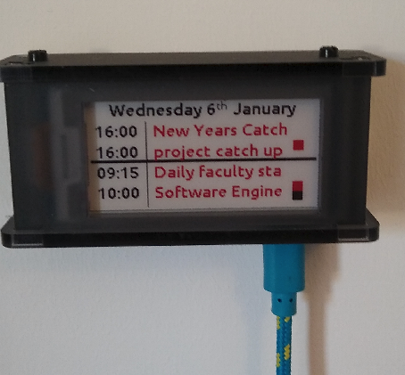

# O365 Calendar on a Raspberry Pi and e-Ink Display



## Motivation
I found myself frequently checking my calendar throughout the day and sometimes reserving a monitor for it. This low-cost, low-power setup saves me a tab and a couple of clicks per day!

The small screen (2.13") presents a few challenges in displaying the data. I decided to show the start time of each meeting with the duration indicated by blocks on the right hand side (1 block = 30 mins). A solid line demarcates between today and tomorrow's meetings.

## Hardware

* [Raspberry Pi Zero](https://thepihut.com/products/raspberry-pi-zero-w)
* [Waveshare 2.13" e-ink display](https://thepihut.com/products/three-colour-2-13-eink-display-phat-red-black-white)
* [Case](https://thepihut.com/products/pi-zero-case-for-waveshare-2-13-eink-display)

Total cost is around £35

## O365 Tokens
You need to register a new app against your O365 account with permission to read from your calendar. To do this:
* Go to [App Registrations](https://portal.azure.com/#blade/Microsoft_AAD_RegisteredApps/ApplicationsListBlade)
* Create a new registration
* The supported account type should be "Accounts in this organizational directory only". No redirect URI is required.
* Open your registration, and under "Client credentials", click "Add a certificate or secret"
* Add a new client secret with an expiry date of your choice
* Make a note of your application id and value of your client secret for the deployment step (the secret ID isn't needed)

## Deploying to the pi
* Clone this repo into your desired location (e.g. /home/pi/O365CalendarPi)
* Using your favourite text editor, populate a new file called `creds.py` with `credentials = ('application id', 'client secret value')` from the previous step
* Create a virtual environment in this directory:
  ```bash
  python3 -m venv venv
  ```
* Activate the virtual environment and install dependencies:
  ```bash
  source venv/bin/activate && pip install -r requirements.txt
  ```
* Run this to check it works `/home/pi/O365CalendarPi/run.sh`
* To update every 15 minutes, add the following line to /etc/crontab:
    ```bash
    */15 * * * * pi	/home/pi/O365CalendarPi/run.sh > /home/pi/log.txt
    ```
* Note that it will only redraw on the screen when the data on the screen changes (this increases the lifetime of the screen).


## Further Work

I would like to generalise to support other calendars and support different size displays. Contributions are very welcome.